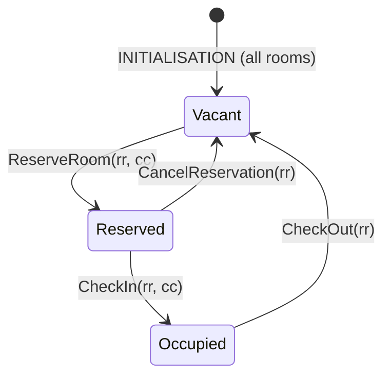

# Assignment 1 — Hotel Booking System (Event-B)

Model a hotel room reservation system with 4 operations: **Reserve**, **Cancel**, **Check-in**, **Check-out**.

## Requirements

1. The system handles room reservation by customers.
2. Exactly 4 operations: reservation, cancellation, check-in, check-out.
3. Only vacant rooms can be reserved.
4. A reservation stores the room and the customer.
5. A reservation can be cancelled.
6. After cancellation, the room becomes vacant.
7. After check-in, the room becomes "occupied".
8. Each occupied room is reserved and associated with the same customer.
9. After check-out, the room becomes vacant.
10. A vacant room cannot simultaneously be reserved or occupied.
11. After cancellation or check-out, all reservation info is deleted.

## Room Lifecycle

## Model Structure

- **Context** `HotelContext` — abstract sets: `CUSTOMER`, `ROOM`
- **Machine** `HotelMachine` — variables: `vacant_rooms` (set), `reserved_rooms` (partial function), `occupied_rooms` (partial function)

## Key Invariants

| ID   | Invariant                                  | Requirement |
|------|--------------------------------------------|-------------|
| inv4 | `vacant_rooms ∩ dom(reserved_rooms) = ∅`   | Req 10      |
| inv5 | `vacant_rooms ∩ dom(occupied_rooms) = ∅`   | Req 10      |
| inv6 | `occupied_rooms ⊆ reserved_rooms`          | Req 8       |
