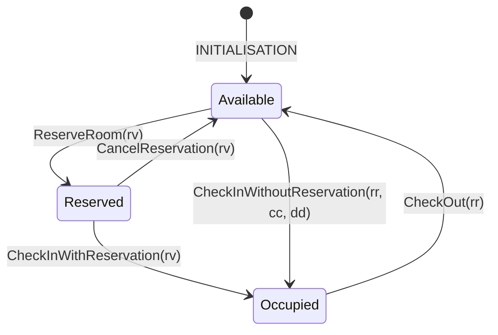

# Assignment 2 — Extended Hotel Booking System (Event-B)

Model an extended hotel room reservation system with date tracking and 5 operations: **Reserve**, **Cancel**, **Check-in (with reservation)**, **Check-in (without reservation)**, **Check-out**.

## Requirements

1. The system handles room reservation by customers.
2. Five operations: reservation, cancellation, check-in with reservation, check-in without reservation, check-out.
3. Each reservation is stored until cancelled or the customer checks in.
4. A reservation stores the room, dates, and customer.
5. Reservation dates cannot overlap with other reservation/occupied dates for the same room.
6. A reservation can be cancelled.
7. After cancellation, the reservation is removed from the system.
8. After check-in (with reservation), the room becomes "occupied" and the reservation is removed.
9. The system tracks occupied rooms, customers, and staying dates.
10. On check-in (with reservation), reservation info is copied to the occupied room.
11. Occupied room dates cannot overlap with reservation/occupied dates for the same room.
12. A customer can check-in without a reservation if the room is available for the specified dates.
13. On check-out, the occupied room info (customer and dates) is removed.

## Room Lifecycle



## Model Structure

- **Context** `HotelExtContext` — abstract sets: `CUSTOMER`, `ROOM`, `DATE`, `RESERVATION`; constant functions: `res_room`, `res_customer`, `res_dates`
- **Machine** `HotelExtMachine` — variables: `active_res` (set), `occ_rooms` (partial function), `occ_dates` (partial function)

## Design Decisions

### Reservations as Abstract Set
Following the lecture hint, reservations are modelled as elements of an abstract carrier set `RESERVATION`. Constant total functions (`res_room`, `res_customer`, `res_dates`) extract the room, customer, and dates from each reservation — similar to accessing object attributes in OOP.

### Dates as Abstract Set
Dates are modelled as an abstract set `DATE`. Reservation and occupation dates are non-empty subsets (`ℙ1(DATE)`). The non-overlap requirements (R5, R11) are expressed as set intersection being empty.

### No Vacant Room Set
Unlike Assignment 1, this model does not track a `vacant_rooms` set. A room is implicitly "available" if it has no active reservations for the requested dates and is not currently occupied. This simplification is possible because dates make the availability check more nuanced than a simple set membership.

## Key Invariants

| ID   | Invariant | Requirement |
|------|-----------|-------------|
| inv4 | `dom(occ_rooms) = dom(occ_dates)` | Consistency |
| inv5 | No overlapping reservation dates for the same room | R5 |
| inv6 | No overlapping reservation/occupied dates for the same room | R5, R11 |

### Theorem Guards for Auto-Prover
`CheckInWithReservation` includes a theorem guard `grd4` that explicitly states the non-overlap of dates between remaining active reservations and the checked-in reservation's dates. Although derivable from `inv5`, this guard provides the intermediate hypothesis Rodin's auto-prover needs to discharge the `inv6` preservation proof obligation — the prover cannot automatically instantiate the universally quantified `inv5` to synthesize the required case split.

## Verification

Proof obligations can be discharged in the Rodin platform. For automated model checking with ProB CLI:

```bash
./verify.sh
```
