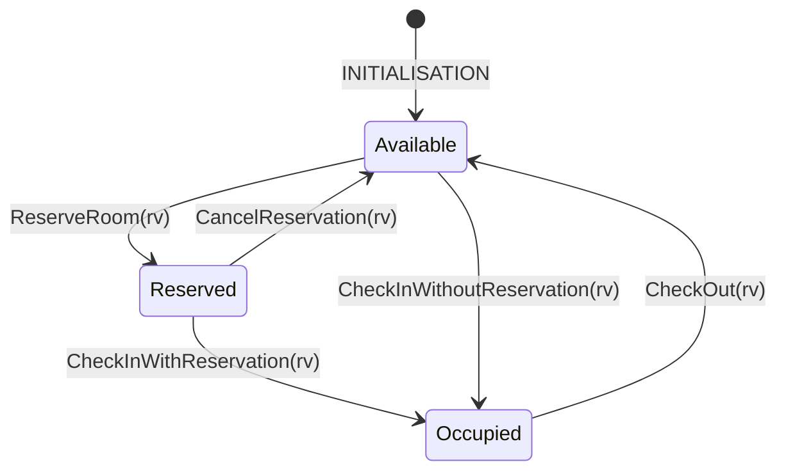

# Assignment 2 — Extended Hotel Booking System (Event-B)

Model an extended hotel room reservation system with date tracking and 5 operations: **Reserve**, **Cancel**, **Check-in (with reservation)**, **Check-in (without reservation)**, **Check-out**.

## Requirements

1. The system handles room reservation by customers.
2. Five operations: reservation, cancellation, check-in with reservation, check-in without reservation, check-out.
3. Each reservation is stored until cancelled or the customer checks in.
4. A reservation stores the room, dates, and customer.
5. Reservation dates cannot overlap with other reservation/occupied dates for the same room.
6. A reservation can be cancelled.
7. After cancellation, the reservation is removed from the system.
8. After check-in (with reservation), the room becomes "occupied" and the reservation is removed.
9. The system tracks occupied rooms, customers, and staying dates.
10. On check-in (with reservation), reservation info is copied to the occupied room.
11. Occupied room dates cannot overlap with reservation/occupied dates for the same room.
12. A customer can check-in without a reservation if the room is available for the specified dates.
13. On check-out, the occupied room info (customer and dates) is removed.

## Room Lifecycle



## Model Structure

- **Context** `HotelExtContext` — abstract sets: `CUSTOMER`, `ROOM`, `DATE`, `RESERVATION`; constant functions: `res_room`, `res_customer`, `res_dates`
- **Machine** `HotelExtMachine` — variables: `active_res` (set of reservations), `occupied` (set of reservations)

### Key insight: reservation = booking
A **reservation** represents a booking with a room, customer, and dates. The *same* reservation can be in the **active** state (pending check-in) or the **occupied** state (customer has checked in). So both `active_res` and `occupied` are sets of `RESERVATION` — we just **move** a reservation between sets rather than copying its data.

---

## Annotated Model

### Context — HotelExtContext

```
CARRIER SETS:
  CUSTOMER        -- abstract set of all possible customers
  ROOM            -- abstract set of all possible rooms
  DATE            -- abstract set of all possible dates
  RESERVATION     -- abstract set of all possible reservations/bookings

CONSTANTS:
  res_room        -- give a reservation → get its room
  res_customer    -- give a reservation → get its customer
  res_dates       -- give a reservation → get its dates (non-empty set)

AXIOMS:
  axm1: res_room     ∈ RESERVATION → ROOM       -- every reservation has exactly one room
  axm2: res_customer ∈ RESERVATION → CUSTOMER   -- every reservation has exactly one customer
  axm3: res_dates    ∈ RESERVATION → ℙ1(DATE)   -- every reservation has a non-empty set of dates
```

These are **constants** — they never change. They define permanent attributes of every possible reservation. `→` = total function (every element must be mapped). `ℙ1(DATE)` = non-empty set of dates.

---

### Machine — HotelExtMachine

#### Variables (system state)

```
  active_res ⊆ RESERVATION   -- reservations currently active (awaiting check-in)
  occupied   ⊆ RESERVATION   -- reservations whose customer has checked in
```

Both are **subsets of RESERVATION** — same type. A reservation starts in neither set, enters `active_res` when reserved, moves to `occupied` when the customer checks in, and leaves both sets on cancellation or checkout.

---

#### Invariants (must always hold)

```
  inv1: active_res ⊆ RESERVATION
      -- active reservations are a subset of all possible reservations

  inv2: occupied ⊆ RESERVATION
      -- occupied bookings are a subset of all possible reservations

  inv3: active_res ∩ occupied = ∅
      -- a reservation can't be both active AND occupied at the same time

  inv4: ∀r1,r2 · r1 ∈ active_res ∧ r2 ∈ active_res ∧ r1 ≠ r2 ∧ res_room(r1) = res_room(r2)
            ⇒ res_dates(r1) ∩ res_dates(r2) = ∅
      -- two DIFFERENT active reservations for the SAME room must have non-overlapping dates

  inv5: ∀r,o · r ∈ active_res ∧ o ∈ occupied ∧ res_room(r) = res_room(o)
            ⇒ res_dates(r) ∩ res_dates(o) = ∅
      -- an active reservation and an occupied booking for the SAME room must have non-overlapping dates

  inv6: ∀o1,o2 · o1 ∈ occupied ∧ o2 ∈ occupied ∧ o1 ≠ o2 ∧ res_room(o1) = res_room(o2)
            ⇒ res_dates(o1) ∩ res_dates(o2) = ∅
      -- two DIFFERENT occupied bookings for the SAME room must have non-overlapping dates
      -- (a room can have multiple future occupied bookings for non-overlapping date ranges)
```

---

#### INITIALISATION

```
  act1: active_res ≔ ∅       -- no active reservations
  act2: occupied   ≔ ∅       -- no occupied bookings
```

---

#### ReserveRoom (parameter: rv)

```
  grd1: rv ∈ RESERVATION
      -- rv is a valid reservation

  grd2: rv ∉ active_res ∪ occupied
      -- rv is not already active or occupied (can't reserve an existing booking)

  grd3: ∀r · r ∈ active_res ∧ res_room(r) = res_room(rv) ⇒ res_dates(r) ∩ res_dates(rv) = ∅
      -- no existing active reservation for the same room has overlapping dates (preserves inv4)

  grd4: ∀o · o ∈ occupied ∧ res_room(o) = res_room(rv) ⇒ res_dates(o) ∩ res_dates(rv) = ∅
      -- no occupied booking for the same room has overlapping dates (preserves inv5)

  act1: active_res ≔ active_res ∪ {rv}
      -- add rv to active reservations
```

---

#### CancelReservation (parameter: rv)

```
  grd1: rv ∈ active_res
      -- rv must be currently active

  act1: active_res ≔ active_res ∖ {rv}
      -- remove rv from active reservations
```

---

#### CheckInWithReservation (parameter: rv)

```
  grd1: rv ∈ active_res
      -- rv must be currently active

  grd2: rv ∉ occupied                                          [THEOREM]
      -- follows from grd1 + inv3 (active and occupied are disjoint)

  grd3: ∀r · r ∈ active_res ∧ r ≠ rv ∧ res_room(r) = res_room(rv)
            ⇒ res_dates(r) ∩ res_dates(rv) = ∅                 [THEOREM]
      -- derivable from inv4 — helps prover discharge inv5 after moving rv to occupied

  grd4: ∀o · o ∈ occupied ∧ res_room(o) = res_room(rv)
            ⇒ res_dates(o) ∩ res_dates(rv) = ∅                 [THEOREM]
      -- derivable from inv5 — helps prover discharge inv6 after moving rv to occupied

  act1: active_res ≔ active_res ∖ {rv}     -- remove from active
  act2: occupied   ≔ occupied ∪ {rv}       -- add to occupied
```

**Elegance:** Customer's room, customer, and dates are preserved automatically — we don't copy anything, we just move the same `rv` between sets. The accessor functions (`res_room(rv)`, etc.) still work because they're defined for all reservations.

---

#### CheckInWithoutReservation (parameter: rv)

```
  grd1: rv ∈ RESERVATION
      -- rv is a valid reservation (holds the walk-in customer's room/customer/dates info)

  grd2: rv ∉ active_res ∪ occupied
      -- rv is not already in the system

  grd3: ∀r · r ∈ active_res ∧ res_room(r) = res_room(rv) ⇒ res_dates(r) ∩ res_dates(rv) = ∅
      -- no existing active reservation for that room clashes (preserves inv5)

  grd4: ∀o · o ∈ occupied ∧ res_room(o) = res_room(rv) ⇒ res_dates(o) ∩ res_dates(rv) = ∅
      -- no existing occupied booking for that room clashes (preserves inv6)

  act1: occupied ≔ occupied ∪ {rv}
      -- add rv directly to occupied (skipping active_res)
```

**Note:** A walk-in is modelled as a fresh `RESERVATION` element that goes straight into `occupied`. Its `res_room`, `res_customer`, `res_dates` already carry the walk-in details.

---

#### CheckOut (parameter: rv)

```
  grd1: rv ∈ occupied
      -- rv must be currently occupied

  act1: occupied ≔ occupied ∖ {rv}
      -- remove rv from occupied
```

---

## Design Decisions

### Unified booking representation
Both reservations and occupied rooms are just `RESERVATION` elements in different sets. This means:
- A booking's room/customer/dates are fixed attributes (from the Context)
- Check-in = moving the booking from `active_res` → `occupied` (no data copying)
- Much simpler invariants and fewer proof obligations

### No functional tracking needed
Unlike using `occ_rooms ∈ ROOM ⇸ CUSTOMER`, using sets allows:
- **Multiple future occupied bookings** for the same room (non-overlapping dates)
- No need for a separate `occ_dates` map — `res_dates(o)` already works
- Consistency invariants like `dom(occ_rooms) = dom(occ_dates)` become unnecessary

### Dates as Abstract Set
Dates are modelled as an abstract set `DATE`. Reservation dates are non-empty subsets (`ℙ1(DATE)`). Non-overlap is expressed as set intersection being empty.

### Theorem guards
Some guards are marked `[THEOREM]` — they are automatically derivable from other guards + invariants, and exist to help Rodin's auto-prover.

## Verification

```bash
./verify.sh
```
