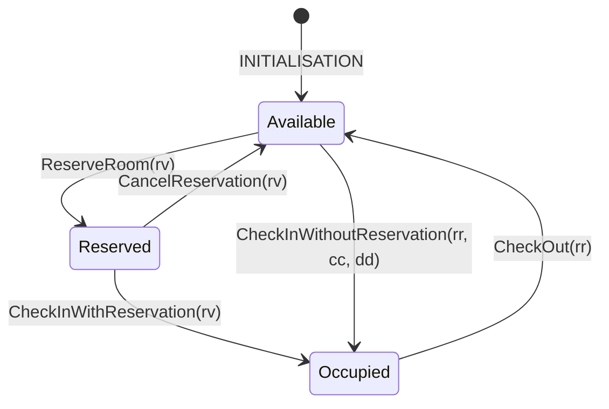

# Assignment 2 — Extended Hotel Booking System (Event-B)

Model an extended hotel room reservation system with date tracking and 5 operations: **Reserve**, **Cancel**, **Check-in (with reservation)**, **Check-in (without reservation)**, **Check-out**.

## Requirements

1. The system handles room reservation by customers.
2. Five operations: reservation, cancellation, check-in with reservation, check-in without reservation, check-out.
3. Each reservation is stored until cancelled or the customer checks in.
4. A reservation stores the room, dates, and customer.
5. Reservation dates cannot overlap with other reservation/occupied dates for the same room.
6. A reservation can be cancelled.
7. After cancellation, the reservation is removed from the system.
8. After check-in (with reservation), the room becomes "occupied" and the reservation is removed.
9. The system tracks occupied rooms, customers, and staying dates.
10. On check-in (with reservation), reservation info is copied to the occupied room.
11. Occupied room dates cannot overlap with reservation/occupied dates for the same room.
12. A customer can check-in without a reservation if the room is available for the specified dates.
13. On check-out, the occupied room info (customer and dates) is removed.

## Room Lifecycle



## Model Structure

- **Context** `HotelExtContext` — abstract sets: `CUSTOMER`, `ROOM`, `DATE`, `RESERVATION`; constant functions: `res_room`, `res_customer`, `res_dates`
- **Machine** `HotelExtMachine` — variables: `active_res` (set), `occ_rooms` (partial function), `occ_dates` (partial function)

---

## Annotated Model

### Context — HotelExtContext

```
CARRIER SETS:
  CUSTOMER        -- abstract set of all possible customers
  ROOM            -- abstract set of all possible rooms
  DATE            -- abstract set of all possible dates
  RESERVATION     -- abstract set of all possible reservations (like pre-made ID cards)

CONSTANTS:
  res_room        -- lookup function: give a reservation → get its room
  res_customer    -- lookup function: give a reservation → get its customer
  res_dates       -- lookup function: give a reservation → get its dates (non-empty set)

AXIOMS:
  axm1: res_room     ∈ RESERVATION → ROOM       -- every reservation has exactly one room (total function)
  axm2: res_customer ∈ RESERVATION → CUSTOMER   -- every reservation has exactly one customer (total function)
  axm3: res_dates    ∈ RESERVATION → ℙ1(DATE)   -- every reservation has a non-empty set of dates (total function)
```

These are **constants** (never change). They define permanent attributes of every possible reservation — like a phone book that always exists. The system reads from them but never modifies them.

`→` = total function: every element in the domain is mapped (every reservation MUST have a room, customer, and dates).

`ℙ1(DATE)` = non-empty powerset of DATE: a set of dates with at least one element.

---

### Machine — HotelExtMachine

#### Variables (system state — changes over time)

```
  active_res ⊆ RESERVATION           -- the set of currently active reservations (subset of all possible ones)
  occ_rooms  ∈ ROOM ⇸ CUSTOMER      -- which rooms are occupied and by whom (give room → get customer)
  occ_dates  ∈ ROOM ⇸ ℙ1(DATE)     -- which rooms are occupied and for which dates (give room → get dates)
```

`⇸` = partial function: NOT every room is mapped — only the currently occupied rooms have entries. A room with no entry is simply not occupied.

---

#### Invariants (rules that must ALWAYS hold, every event must preserve them)

```
  inv1: active_res ⊆ RESERVATION
      -- active reservations are a subset of all possible reservations

  inv2: occ_rooms ∈ ROOM ⇸ CUSTOMER
      -- occ_rooms is a partial function from rooms to customers

  inv3: occ_dates ∈ ROOM ⇸ ℙ1(DATE)
      -- occ_dates is a partial function from rooms to non-empty date sets

  inv4: dom(occ_rooms) = dom(occ_dates)
      -- if a room has a customer assigned, it must also have dates, and vice versa
      -- occ_rooms and occ_dates always go together

  inv5: ∀r1,r2 · r1 ∈ active_res ∧ r2 ∈ active_res ∧ r1 ≠ r2 ∧ res_room(r1) = res_room(r2)
            ⇒ res_dates(r1) ∩ res_dates(r2) = ∅
      -- two DIFFERENT active reservations for the SAME room must have non-overlapping dates
      -- (reservations for different rooms CAN have overlapping dates — that's fine)

  inv6: ∀r,rm,ds · r ∈ active_res ∧ rm ↦ ds ∈ occ_dates ∧ res_room(r) = rm
            ⇒ res_dates(r) ∩ ds = ∅
      -- for any active reservation r: if the reservation's room is currently occupied (rm ↦ ds means
      --   room rm is occupied with dates ds), then the reservation dates and occupied dates must not overlap
      -- you can't have a reservation for dates when someone is already staying in that room
```

`↦` = maplet (a key-value pair). `rm ↦ ds ∈ occ_dates` means "room rm is occupied with dates ds".

`∩` = set intersection. `A ∩ B = ∅` means A and B share no common elements (no overlap).

---

#### INITIALISATION

```
  act1: active_res ≔ ∅       -- no active reservations
  act2: occ_rooms  ≔ ∅       -- no rooms occupied
  act3: occ_dates  ≔ ∅       -- no occupied dates
```

System starts completely empty.

---

#### ReserveRoom (parameter: rv)

```
  grd1: rv ∈ RESERVATION
      -- rv is a valid reservation from the universe of all possible reservations

  grd2: rv ∉ active_res
      -- rv is not already an active reservation (can't reserve twice)

  grd3: ∀r · r ∈ active_res ∧ res_room(r) = res_room(rv) ⇒ res_dates(r) ∩ res_dates(rv) = ∅
      -- for every existing active reservation for the SAME room:
      --   its dates must not overlap with the new reservation's dates
      -- (preserves inv5)

  grd4: ∀rm,ds · rm ↦ ds ∈ occ_dates ∧ rm = res_room(rv) ⇒ res_dates(rv) ∩ ds = ∅
      -- if the room is currently occupied (rm ↦ ds is a pair in occ_dates),
      --   and it's the same room as our new reservation,
      --   then the occupied dates and reservation dates must not overlap
      -- (preserves inv6)

  act1: active_res ≔ active_res ∪ {rv}
      -- add rv to the set of active reservations
```

---

#### CancelReservation (parameter: rv)

```
  grd1: rv ∈ active_res
      -- rv must be a currently active reservation (can only cancel what exists)

  act1: active_res ≔ active_res ∖ {rv}
      -- remove rv from the set of active reservations
      -- ∖ = set minus (remove from set)
```

---

#### CheckInWithReservation (parameter: rv)

```
  grd1: rv ∈ active_res
      -- rv must be a currently active reservation

  grd2: res_room(rv) ∉ dom(occ_rooms)
      -- the reservation's room must NOT be currently occupied by anyone
      -- dom(occ_rooms) = the set of all currently occupied rooms

  grd3: res_room(rv) ∉ dom(occ_dates)                          [THEOREM]
      -- the reservation's room must NOT be in occ_dates either
      -- this is automatically true from grd2 + inv4 (they share the same domain)
      -- marked as theorem: not a real guard, just helps Rodin's auto-prover

  grd4: ∀r · r ∈ active_res ∧ r ≠ rv ∧ res_room(r) = res_room(rv)
            ⇒ res_dates(r) ∩ res_dates(rv) = ∅
      -- all OTHER active reservations for the SAME room must have non-overlapping dates
      -- this is derivable from inv5, but stated explicitly to help the prover discharge inv6

  act1: active_res ≔ active_res ∖ {rv}
      -- remove the reservation from active set (it's been fulfilled)

  act2: occ_rooms ≔ occ_rooms ∪ {res_room(rv) ↦ res_customer(rv)}
      -- mark the room as occupied by the reservation's customer
      -- copies: reservation's room → reservation's customer into occ_rooms

  act3: occ_dates ≔ occ_dates ∪ {res_room(rv) ↦ res_dates(rv)}
      -- record the occupied dates for the room
      -- copies: reservation's room → reservation's dates into occ_dates
```

The reservation info is **moved**: removed from active_res and **copied** into occ_rooms + occ_dates.

---

#### CheckInWithoutReservation (parameters: rr = room, cc = customer, dd = dates)

```
  grd1: rr ∈ ROOM
      -- rr is a valid room

  grd2: cc ∈ CUSTOMER
      -- cc is a valid customer

  grd3: dd ∈ ℙ1(DATE)
      -- dd is a valid non-empty set of dates

  grd4: rr ∉ dom(occ_rooms)
      -- the room must NOT be currently occupied

  grd5: ∀r · r ∈ active_res ∧ res_room(r) = rr ⇒ res_dates(r) ∩ dd = ∅
      -- for every active reservation for this room:
      --   its dates must not overlap with the walk-in dates
      -- can't walk into a room that has reservations clashing with your dates

  grd6: rr ∉ dom(occ_dates)                                    [THEOREM]
      -- follows from grd4 + inv4 (same logic as CheckInWithReservation grd3)

  grd7: ∀r,rm,ds · r ∈ active_res ∧ rm ↦ ds ∈ occ_dates ∧ res_room(r) = rm
            ⇒ res_dates(r) ∩ ds = ∅                            [THEOREM]
      -- restates inv6 — helps prover preserve inv6 after adding new occupied entry

  act1: occ_rooms ≔ occ_rooms ∪ {rr ↦ cc}
      -- mark room rr as occupied by customer cc

  act2: occ_dates ≔ occ_dates ∪ {rr ↦ dd}
      -- record the occupied dates dd for room rr
```

Walk-in customer: no reservation needed, just provide room + customer + dates directly.

---

#### CheckOut (parameter: rr)

```
  grd1: rr ∈ dom(occ_rooms)
      -- the room must be currently occupied (exists in occ_rooms)

  grd2: rr ∈ dom(occ_dates)                                    [THEOREM]
      -- follows from grd1 + inv4

  act1: occ_rooms ≔ {rr} ⩤ occ_rooms
      -- remove room rr from occ_rooms
      -- ⩤ = domain subtraction: removes all pairs where the key is rr

  act2: occ_dates ≔ {rr} ⩤ occ_dates
      -- remove room rr from occ_dates
```

Customer leaves. Both occupied records (customer and dates) are removed.

`⩤` = domain subtraction: `{rr} ⩤ f` removes all entries from function `f` where the key is `rr`.

---

## Design Decisions

### Reservations as Abstract Set
Following the lecture hint, reservations are modelled as elements of an abstract carrier set `RESERVATION`. Constant total functions (`res_room`, `res_customer`, `res_dates`) extract the room, customer, and dates from each reservation — similar to accessing object attributes in OOP.

### Dates as Abstract Set
Dates are modelled as an abstract set `DATE`. Reservation and occupation dates are non-empty subsets (`ℙ1(DATE)`). The non-overlap requirements (R5, R11) are expressed as set intersection being empty.

### No Vacant Room Set
Unlike Assignment 1, this model does not track a `vacant_rooms` set. A room is implicitly "available" if it has no active reservations for the requested dates and is not currently occupied. This simplification is possible because dates make the availability check more nuanced than a simple set membership.

### Theorem Guards
Some guards are marked as `[THEOREM]` — they are not real conditions but are **automatically derivable** from other guards + invariants. They exist solely to help Rodin's auto-prover discharge proof obligations. The prover sometimes cannot automatically make the logical connection, so we state the intermediate step explicitly.

## Verification

Proof obligations can be discharged in the Rodin platform. For automated model checking with ProB CLI:

```bash
./verify.sh
```
